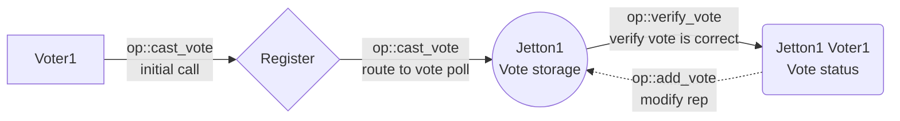

# Introduction

The goal of this project is to create on-chain Jetton voting platform. The system consists of 3 primary contracts: `Register`, `Vote Storage` and `Vote Status`. 

The `Register` contract is the entry point of the system, it stores a number of wallet addresses that are allowed to vote ("voters" or "voting participants") and has an admin responsible for adding/removing addresses from this list, as well as other administrative functions. The `Register` routes vote calls to a `Vote Storage` contract, which is unique for each Jetton address. 

`Vote Storage` stores all accumulated "positive" and "negative" votes cast by voting participants and routes voter calls to `Vote Status` for vote verification (each `Vote Status` is unique for each Jetton for each voting participant). 

`Vote Status` checks, if a voter's vote is valid, and messages `Vote Storage` to modify a total vote count. All voting participants' votes are equal in power and each voter can vote only once for each Jetton address (as well as change their vote from "positive" to "negative" and vice versa). A voting participant may also reset their vote by sending both "positive" and "negative" values as 0.

To determine a status of a Jetton one must query an appropriate `Vote Storage` contract, which will return contract's stored "positive" and "negative" votes; an exact formula of a Jetton reputation is up to the frontend implementation, which is independent of this system, but it is suggested to place a heavy emphasis on "negative" votes or even make a single "negative" vote outweigh any number of "positive" votes.

It is important to note that the suggested system is not limited to voting only for Jettons. In fact, any valid arbitrary address can be voted for: addresses of NFTs, addresses of wallets, etc.

# Message logic

## Initial vote casting by a user

A voting participant sends a custom payload to the `Register` contract with a Jetton address and their vote ("positive" or "negative"). The register verifies that the sender is allowed to cast their vote by checking the list of allowed addresses. The register routes the call to the `Vote storage` contract for the Jetton which forwards this call to voter's `Vote status` to verify if their vote is eligible. Finally, `Vote status` will send a message to modify the reputation of the Jetton to its `Vote storage` contract.

## Vote change

The mechanism is the same, except that `Vote status` contract checks if the new vote is different from the previous one.

## Reset vote

To reset their vote a voting participant sends both votes values as 0.

## Checking Jetton

Checking is done through an off-chain get method on `Vote storage`.

# Register contract

Main contract that routes voting participant's calls to the correct `Vote storage` contracts.

## Storage

- admin address
- pending admin address
- voters address list (as dict)
- `Vote Storage` code
- `Vote Status` code

## Off-chain getters

### `get_vote_storage_address`

Returns an address of a `Vote Storage` contract for a vote address (Jetton address). 

Args:
- vote address

### `get_register_data`

Returns data from storage:
- admin address
- pending admin address
- voters address list (as dict)
- `Vote Storage` code
- `Vote Status` code

## Admin messages

Those messages are sent by the `admin`.

### **Message table**

| Name               | Code       | Description                                       |
| ------------------ | ---------- | ------------------------------------------------- |
| `add_voter`         | 0x9b3f4098 | Add a new address than is allowed to vote         |
| `remove_voter`      | 0x9b23def8 | Remove address from the list of allowed addresses |
| `change_admin`     | 0xd4deb03b | Change admin to a new address                     |
| `rest_gas`         | 0x42a0fb43 | Reset `Register` balance to min amount            |
| `rest_gas_storage` | 0xda764ba3 | Reset `Vote Storage` balance to min amount        |

### add_voter

Add a new address to the list which are allowed to vote on a Jetton status.

#### **Incoming message body**

| Name           | Type      | Description                              |
| -------------- | --------- | ---------------------------------------- |
| `op`           | `uint32`  | Operation code                           |
| `query_id`     | `uint64`  | Query id                                 |
| `voter_address` | `address` | Address of a user to be added as a voter |

### remove_voter

Remove a user from the list of voting participant.

#### **Incoming message body**

| Name           | Type      | Description                                |
| -------------- | --------- | ------------------------------------------ |
| `op`           | `uint32`  | Operation code                             |
| `query_id`     | `uint64`  | Query id                                   |
| `voter_address` | `address` | Address of a user to be removed as a voter |

### change_admin

Set a new `admin` address.

#### **Incoming message body**

| Name           | Type      | Description                           |
| -------------- | --------- | ------------------------------------- |
| `op`           | `uint32`  | Operation code                        |
| `query_id`     | `uint64`  | Query id                              |
| `new_admin_address` | `address` | Address of a new admin |

### reset_gas

Resets contract balance to `MIN_TON_REGISTER` (0.1 $TON).

#### **Incoming message body**

| Name       | Type     | Description    |
| ---------- | -------- | -------------- |
| `op`       | `uint32` | Operation code |
| `query_id` | `uint64` | Query id       |

#### Outgoing messages

Sends the rest of the balance to admin.

### reset_gas_storage

Resets `Vote Storage` balance to `MIN_TON_VOTE_STORAGE` (0.05 $TON).

#### **Incoming message body**

| Name             | Type     | Description    |
| ---------------- | -------- | -------------- |
| `op`             | `uint32` | Operation code |
| `query_id`       | `uint64` | Query id       |
| `vote_address` | `address`  | Jetton address |

#### Outgoing messages

Sends a message with `reset_gas` op to a `Vote Storage` contract.

## User messages

Those messages are sent by users.
### **Message table**

| Name          | Code       | Description                                  |
| ------------- | ---------- | -------------------------------------------- |
| `claim_admin` | 0xb443e630 | Claim new admin status by a new address      |
| `cast_vote`   | 0x13828ee9 | Cast a vote for "positive" or "negative" status |

### claim_admin

Claim an admin status. This call can only be made by a new admin that was specified by `change_admin` operation.

#### **Incoming message body**

| Name       | Type     | Description    |
| ---------- | -------- | -------------- |
| `op`       | `uint32` | Operation code |
| `query_id` | `uint64` | Query id       |

### cast_vote

Casts voting participant's vote for "positive" or "negative". Can cast an opposite vote for vote change or with both values as 0 to reset vote. 
#### **Incoming message body**

| Name             | Type      | Description                      |
| ---------------- | --------- | -------------------------------- |
| `op`             | `uint32`  | Operation code                   |
| `query_id`       | `uint64`  | Query id                         |
| `vote_address` | `address` | An address of a Jetton           |
| `positive_vote`     | `uint1`   | If a user votes for "positive" |
| `negative_vote`     | `uint1`   | If a user votes for "negative" |

Notes:

- `positive_vote` and `negative_vote` are not allowed to have value of 1 at the same time

#### Outgoing messages

Sends a messages to `Vote Storage` with `cast_vote` op code.

# Vote storage contract

Stores a Jetton rep and forwards calls from voters to `Vote status` contracts for vote eligibility verification.

## Storage

- `Register` address
- vote address (Jetton address)
- voters' "positive" votes
- voters' "negative" votes
- `Vote Status` code

## Off-chain getters

### `get_vote_status_address`

Returns an address of a `Vote Status` contract for a voting participant for this `Vote Storage`.

Args:
- voter address

### `get_vote_storage_data`

Returns data from storage:
- `Register` address
- vote address (Jetton address)
- "positive" votes
- "negative" votes
- `Vote Status` code

## Internal messages

Those messages are sent by contracts.
### **Message table**

| Name        | Code       | Description                                                      |
| ----------- | ---------- | ---------------------------------------------------------------- |
| `cast_vote` | 0x13828ee9 | Is received from `Register`; forwards this call to `Vote Status` |
| `add_vote`  | 0x54e85894 | Is received from `Vote Status`; modify votes on storage          |
| `rest_gas`  | 0x42a0fb43 | Reset contract balance to min amount                             |

### cast_vote

Forward validity check of the call to `Vote Status`.
#### **Incoming message body**

| Name             | Type      | Description                      |
| ---------------- | --------- | -------------------------------- |
| `op`             | `uint32`  | Operation code                   |
| `query_id`       | `uint64`  | Query id                         |
| `voter_address`   | `address` | An address of a voting participant           |
| `vote_address` | `address` | An address of a Jetton           |
| `positive_vote`     | `uint1`   | If a user votes for "positive" |
| `negative_vote`     | `uint1`   | If a user votes for "negative" |

#### Outgoing messages

Sends a messages to `Vote Status` with `verify_vote` op code.

### add_vote

Modify votes on storage after user's call was verified by `Vote Status`

#### **Incoming message body**

| Name           | Type      | Description                         |
| -------------- | --------- | ----------------------------------- |
| `op`           | `uint32`  | Operation code                      |
| `query_id`     | `uint64`  | Query id                            |
| `voter_address` | `address` | An address of a voting participant              |
| `positive_add`    | `int2`    | Number of "positive" votes to add |
| `negative_add`    | `int2`    | Number of "negative" votes to add |

#### Outgoing messages

Sends remaining gas to the voter.

### reset_gas

Resets contract balance to `MIN_TON_VOTE_STORAGE` (0.05 $TON).

#### **Incoming message body**

| Name            | Type     | Description            |
| --------------- | -------- | ---------------------- |
| `op`            | `uint32` | Operation code         |
| `query_id`      | `uint64` | Query id               |
| `admin_address` | `address`  | Register admin address |

#### Outgoing messages

Sends the rest of the balance to admin.

# Vote status contract

Verifies that a voting participant is allowed to cast their vote and forwards a message back to `Vote storage` to add their vote to the total count of "positive" and "negative" votes.

## Storage

- vote address (Jetton address)
- voter address
- `Vote Storage` address
- voter's "positive" vote status (0 or 1)
- voter's "negative" vote status (0 or 1)

## Off-chain getters

### `get_vote_status_data`

Returns data from storage:
- vote address (Jetton address)
- voter address
- `Vote Storage` address
- "positive" vote
- "negative" vote

## Internal messages

Those messages are sent by contracts
### **Message table**

| Name          | Code       | Description                                                                 |
| ------------- | ---------- | --------------------------------------------------------------------------- |
| `verify_vote` | 0x5e73911f | Is received from `Vote Storage`; check if a voter is eligible to cast a vote |

### verify_vote

Check if voter's vote is correct, i.e. it is an initial vote, a vote change or a reset.

#### **Incoming message body**

| Name         | Type     | Description                      |
| ------------ | -------- | -------------------------------- |
| `op`         | `uint32` | Operation code                   |
| `query_id`   | `uint64` | Query id                         |
| `positive_vote` | `uint1`  | If a voters votes for "positive" |
| `negative_vote` | `uint1`  | If a voters votes for "negative" |

#### Outgoing messages

Sends a messages to `Vote Storage` with `add_vote` op code

## Voters messages

Those messages are sent by voters.
### **Message table**

| Name       | Code       | Description                          |
| ---------- | ---------- | ------------------------------------ |
| `rest_gas` | 0x42a0fb43 | Reset contract balance to min amount |

### reset_gas

Resets contract balance to `MIN_TON_VOTE_STATUS` (0.01 $TON).

#### **Incoming message body**

| Name       | Type     | Description    |
| ---------- | -------- | -------------- |
| `op`       | `uint32` | Operation code |
| `query_id` | `uint64` | Query id       |

#### Outgoing messages

Sends the rest of the balance to the voter.

