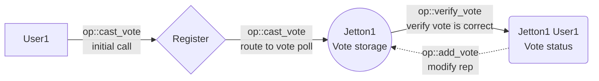

# Introduction

The goal of this project is to create on-chain jetton voting platform. The system consists of 3 primary contracts: `Register`, `Vote Storage` and `Vote Status`. 

The `Register` contract is the entry point of the system, it stores a number of wallet addresses which are allowed to vote and has an admin responsible for adding/removing user addresses from this list, as well as other administrative functions.  The `Register` routs vote calls to a `Vote Storage` contract, which is unique for each Jetton address. 

`Vote Storage` stores all accumulated "trusted" and "untrusted" votes cast by users and routs user calls to `Vote Status` for vote verification (each `Vote Status` is unique for each Jetton for each user). 

`Vote Status` checks, if a user's vote is valid, and messages `Vote Storage` to modify a total vote count. All user votes are equal in power and each user can vote only once for each Jetton address (as well as change their vote from "trusted" to "untrusted" and vice versa). 

To determine a status of a Jetton one must query an appropriate `Vote Storage` contract, which will return contract's stored "trusted" and "untrusted" votes; an exact formula of a Jetton reputation is up to the frontend implementation, which is independent of this system, but it is suggested to place a heavy emphasis on "untrusted" votes or even make a single "untrusted" vote outweigh any number of "trusted" votes.

# Message logic

## Initial vote casting by a user

A user sends a custom payload to the `Register` contract with a Jetton address and their vote ("trusted" or "untrusted"). The register verifies that the user is allowed to cast their vote by checking the list of allowed addresses. The register routes the call to the `Vote storage` contract for the Jetton which forward this call to user's `Vote status` to verify if their vote is eligible. Finally, `Vote status` will send a message to modify the reputation of the Jetton to its `Vote storage` contract.

## Vote change

The mechanism is the same, except that `Vote status` contract checks if the new vote is different from the previous one.

## Checking Jetton

Checking is done through an off-chain get method on `Vote storage`

# Register contract

Main contract that routes user calls to the correct `Vote storage` contracts

## Storage

- admin address
- pending admin address
- voters address list (as dict)
- `Vote Storage` code
- `Vote Status` code

## Off-chain getters

### `get_vote_storage_address`

Returns an address of a `Vote Storage` contract for a Jetton address. 

Args:
- Jetton address

### `get_register_data`

Returns data from storage:
- admin address
- pending admin address
- voters address list (as dict)
- `Vote Storage` code
- `Vote Status` code

## Admin messages

Those messages are sent by the `admin`

### **Message table**

| Name               | Code       | Description                                       |
| ------------------ | ---------- | ------------------------------------------------- |
| `add_user`         | 0x836b0bb9 | Add a new address than is allowed to vote         |
| `remove_user`      | 0x9ff56bb9 | Remove address from the list of allowed addresses |
| `change_admin`     | 0xd4deb03b | Change admin to a new address                     |
| `rest_gas`         | 0x42a0fb43 | Reset `Register` balance to min amount            |
| `rest_gas_storage` | 0xda764ba3 | Reset `Vote Storage` balance to min amount        |

### add_user

Add a new address to the list which are allowed to vote on a Jetton status

#### **Incoming message body**

| Name           | Type      | Description                              |
| -------------- | --------- | ---------------------------------------- |
| `op`           | `uint32`  | Operation code                           |
| `query_id`     | `uint64`  | Query id                                 |
| `user_address` | `address` | Address of a user to be added as a voter |

### remove_user

Remove a user from the list of allowed to vote users

#### **Incoming message body**

| Name           | Type      | Description                                |
| -------------- | --------- | ------------------------------------------ |
| `op`           | `uint32`  | Operation code                             |
| `query_id`     | `uint64`  | Query id                                   |
| `user_address` | `address` | Address of a user to be removed as a voter |

### change_admin

Set a new `admin` address

#### **Incoming message body**

| Name           | Type      | Description                           |
| -------------- | --------- | ------------------------------------- |
| `op`           | `uint32`  | Operation code                        |
| `query_id`     | `uint64`  | Query id                              |
| `user_address` | `address` | Address of a user to be the new admin |

### reset_gas

Resets contract balance to `MIN_TON_REGISTER` (0.1 $TON).

#### **Incoming message body**

| Name       | Type     | Description    |
| ---------- | -------- | -------------- |
| `op`       | `uint32` | Operation code |
| `query_id` | `uint64` | Query id       |

#### Outgoing messages

Sends the rest of the balance to admin.

### reset_gas_storage

Resets `Vote Storage` balance to `MIN_TON_VOTE_STORAGE` (0.05 $TON).

#### **Incoming message body**

| Name             | Type     | Description    |
| ---------------- | -------- | -------------- |
| `op`             | `uint32` | Operation code |
| `query_id`       | `uint64` | Query id       |
| `jetton_address` | `address`  | Jetton address |

#### Outgoing messages

Sends a message with `reset_gas` op to a `Vote Storage` contract.

## User messages

Those messages are sent by users
### **Message table**

| Name          | Code       | Description                                  |
| ------------- | ---------- | -------------------------------------------- |
| `claim_admin` | 0xb443e630 | Claim new admin status by a new address      |
| `cast_vote`   | 0x13828ee9 | Cast a vote for "trusted" or "untrusted" |

### claim_admin

Claim an admin status. This call can only be made by a user that was specified by `change_admin` operation

#### **Incoming message body**

| Name       | Type     | Description    |
| ---------- | -------- | -------------- |
| `op`       | `uint32` | Operation code |
| `query_id` | `uint64` | Query id       |

### cast_vote

Casts user's vote for "trusted" or "untrusted". Can cast an opposite vote for vote change. 
#### **Incoming message body**

| Name             | Type      | Description                      |
| ---------------- | --------- | -------------------------------- |
| `op`             | `uint32`  | Operation code                   |
| `query_id`       | `uint64`  | Query id                         |
| `jetton_address` | `address` | An address of a Jetton           |
| `white_vote`     | `uint1`   | If a user votes for "trusted" |
| `black_vote`     | `uint1`   | If a user votes for "untrusted" |

Notes:

- `white_vote` and `black_vote` are not allowed to have the same value

#### Outgoing messages

Sends a messages to `Vote Storage` with `cast_vote` op code

# Vote storage contract

Stores a Jetton rep and forwards calls from users to `Vote status` contracts for vote eligibility verification

## Storage

- `Register` address
- Jetton address
- users' "trusted" votes
- users' "untrusted" votes
- `Vote Status` code

## Off-chain getters

### `get_vote_status_address`

Returns an address of a `Vote Status` contract for a user for this `Vote Storage`

Args:
- user address

### `get_vote_storage_data`

Returns data from storage:
- `Register` address
- Jetton address
- "trusted" votes
- "untrusted" votes
- `Vote Status` code

## Internal messages

Those messages are sent by contracts
### **Message table**

| Name        | Code       | Description                                                      |
| ----------- | ---------- | ---------------------------------------------------------------- |
| `cast_vote` | 0x13828ee9 | Is received from `Register`; forwards this call to `Vote Status` |
| `add_vote`  | 0x54e85894 | Is received from `Vote Status`; modify votes on storage          |
| `rest_gas`  | 0x42a0fb43 | Reset contract balance to min amount                             |

### cast_vote

Forward validity check of the call to `Vote Status`
#### **Incoming message body**

| Name             | Type      | Description                      |
| ---------------- | --------- | -------------------------------- |
| `op`             | `uint32`  | Operation code                   |
| `query_id`       | `uint64`  | Query id                         |
| `user_address`   | `address` | An address of a Jetton           |
| `jetton_address` | `address` | An address of a Jetton           |
| `white_vote`     | `uint1`   | If a user votes for "trusted" |
| `black_vote`     | `uint1`   | If a user votes for "untrusted" |

#### Outgoing messages

Sends a messages to `Vote Status` with `verify_vote` op code

### add_vote

Modify votes on storage after user's call was verified by `Vote Status`

#### **Incoming message body**

| Name           | Type      | Description                         |
| -------------- | --------- | ----------------------------------- |
| `op`           | `uint32`  | Operation code                      |
| `query_id`     | `uint64`  | Query id                            |
| `user_address` | `address` | An address of a Jetton              |
| `white_add`    | `int2`    | Number of "trusted" votes to add |
| `black_add`    | `int2`    | Number of "untrusted" votes to add |

#### Outgoing messages

Sends remaining gas to user

### reset_gas

Resets contract balance to `MIN_TON_VOTE_STORAGE` (0.05 $TON).

#### **Incoming message body**

| Name            | Type     | Description            |
| --------------- | -------- | ---------------------- |
| `op`            | `uint32` | Operation code         |
| `query_id`      | `uint64` | Query id               |
| `admin_address` | `address`  | Register admin address |

#### Outgoing messages

Sends the rest of the balance to admin.

# Vote status contract

Verifies that a user is allowed to cast their vote and forwards a message back to `Vote storage` to add their vote to the rep

## Storage

- Jetton address
- user address
- `Vote Storage` address
- user's "trusted" vote status (0 or 1)
- user's "untrusted" vote status (0 or 1)

## Off-chain getters

### `get_vote_status_data`

Returns data from storage:
- Jetton address
- user address
- `Vote Storage` address
- "trusted" vote
- "untrusted" vote

## Internal messages

Those messages are sent by contracts
### **Message table**

| Name          | Code       | Description                                                                 |
| ------------- | ---------- | --------------------------------------------------------------------------- |
| `verify_vote` | 0x5e73911f | Is received from `Vote Storage`; check if a user is eligible to cast a vote |

### verify_vote

Check if user's vote is correct, i.e. it is an initial vote or a vote change

#### **Incoming message body**

| Name         | Type     | Description                      |
| ------------ | -------- | -------------------------------- |
| `op`         | `uint32` | Operation code                   |
| `query_id`   | `uint64` | Query id                         |
| `white_vote` | `uint1`  | If a user votes for "trusted" |
| `black_vote` | `uint1`  | If a user votes for "untrusted" |

#### Outgoing messages

Sends a messages to `Vote Storage` with `add_vote` op code

## User messages

Those messages are sent by users.
### **Message table**

| Name       | Code       | Description                          |
| ---------- | ---------- | ------------------------------------ |
| `rest_gas` | 0x42a0fb43 | Reset contract balance to min amount |

### reset_gas

Resets contract balance to `MIN_TON_VOTE_STATUS` (0.01 $TON).

#### **Incoming message body**

| Name       | Type     | Description    |
| ---------- | -------- | -------------- |
| `op`       | `uint32` | Operation code |
| `query_id` | `uint64` | Query id       |

#### Outgoing messages

Sends the rest of the balance to the user.

